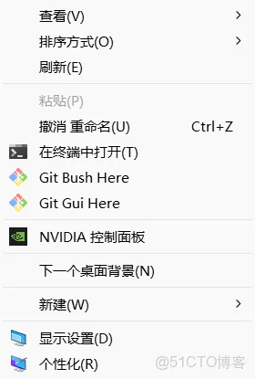
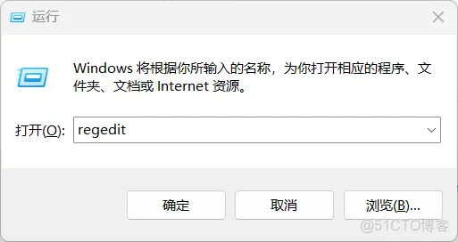
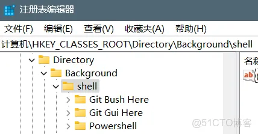
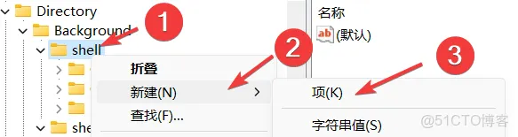
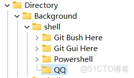
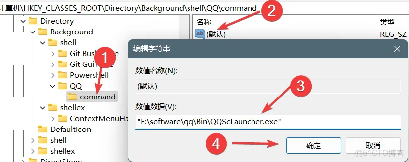
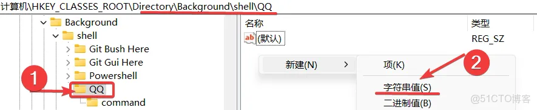
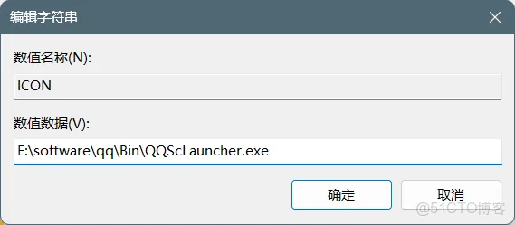

# 在注册表中操作添加右键菜单中 exe 的快捷方式

1\. 问题描述
--------

想要在右键菜单中添加快捷功能，如图中的 `Git Bush Here`，可以直接通过左键在当前路径(右键点击的位置)打开这个程序。

2\. 添加过程
--------

### 2.1 打开注册表编辑器

通过 `Win`+`R` 快捷键打开 `运行`，并输入 `regedit` 点击确定进入注册表页面。

### 2.2 找到管理右键菜单的注册表

路径是 `HKEY_CLASSES_ROOT\Directory\Background\shell`，

`shell` 目录中的内容就是右键菜单中的快捷方式。

### 2.3 添加新的快捷方式

首先添加一个新的项

比如添加一个名为 `QQ` 的项(根据自己的需求来设定)

那么此时右键就会出现一个 `QQ`，但是点击没有任何反应，因为我们还没有对它进行一个设置。

### 2.4 配置快捷方式

首先在新建的 `QQ` 这个项中添加一个 `command` 项(大小写都可以)，修改 `command` 项中的默认的 `数据`(双击即可)，然后把 `数据` 修改为需要打开的 exe 的路径(根据自己的需求)。

此时，通过右键菜单可以用快捷方式打开此程序了。

### 2.5 给快捷方式添加图标

可以看到示例中的右键快捷方式中 `Git Bush Here` 是有图标的，而我们新建的 `QQ` 是没有的，那么我们来给它添加一个图标。

首先，我们点击刚才创建的 `QQ` 项(注意点击的不是 `command` 项)，右键新建一个 `字符串值`，`名称` 设置为 `ICON`(大小写都可，Icon 也可以)。

双击后设置 `数据` 为和刚才一样的路径，当然如果能找到 ico 图标文件也可以，或者自己重新找一个图标也可以。

`数值数据` 的内容加或者不加双引号 "" 都是可以的。

最终我们可以看到成果。

本文转自 <https://blog.51cto.com/u_15444/13792328>，如有侵权，请联系删除。